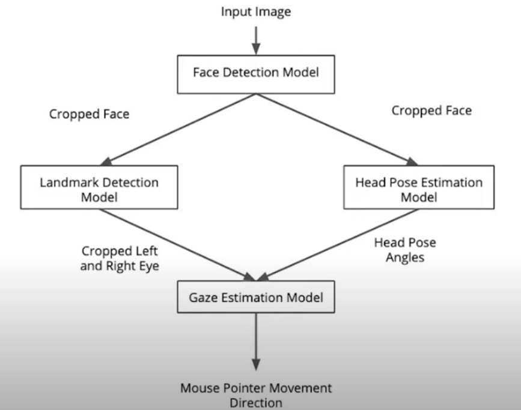
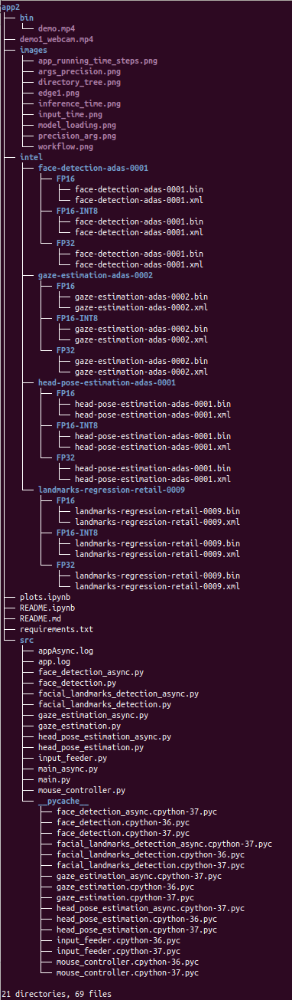
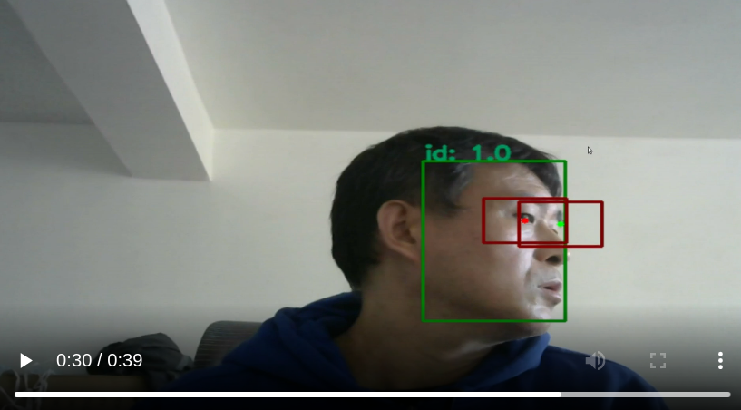
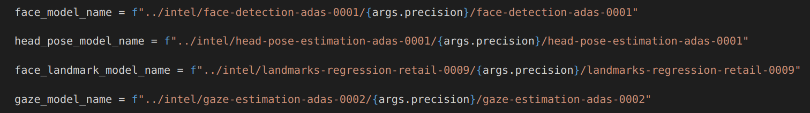
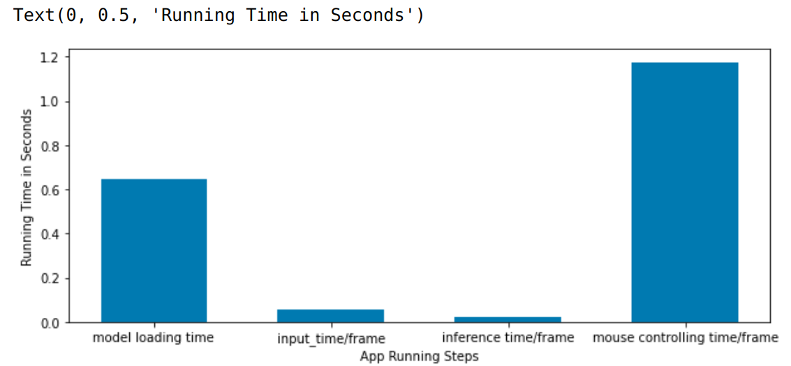
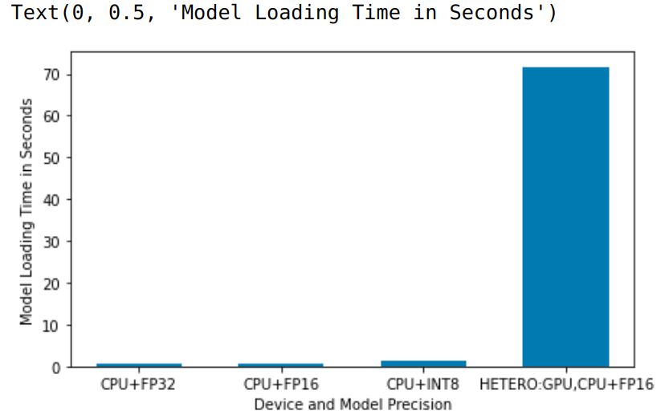
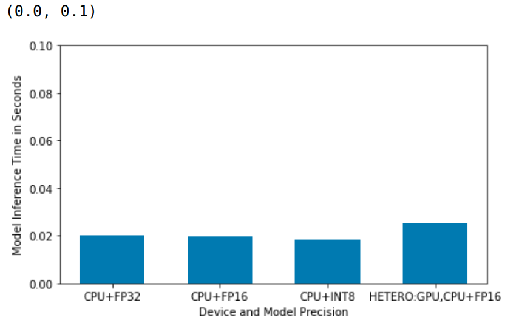
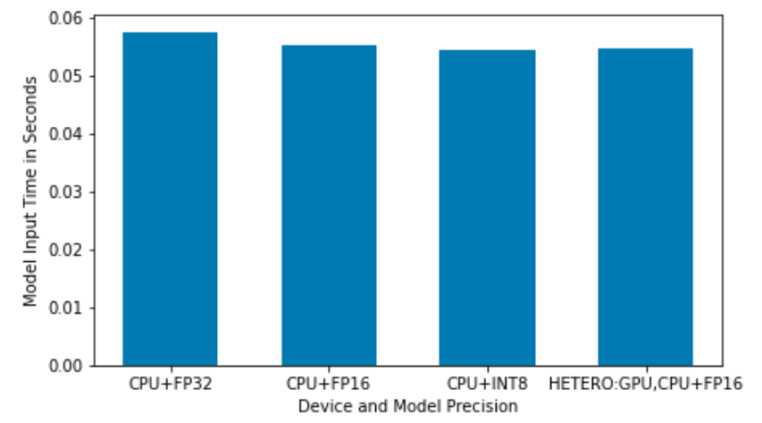
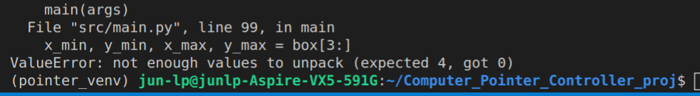

# Use Eye Gaze to control Mouse Pointer.

The goal of project is to build an application that use human gaze to control mouse movement. In order to achieve that, I need to use 4 prebuilt AI models as listed below:

* [face-detection-model](https://docs.openvinotoolkit.org/latest/_models_intel_face_detection_adas_binary_0001_description_face_detection_adas_binary_0001.html)
* [landmarks-detection-model](https://docs.openvinotoolkit.org/latest/_models_intel_landmarks_regression_retail_0009_description_landmarks_regression_retail_0009.html)
* [head-pose-estimation-model](https://docs.openvinotoolkit.org/latest/_models_intel_head_pose_estimation_adas_0001_description_head_pose_estimation_adas_0001.html)
* [gaze-estimation-model](https://docs.openvinotoolkit.org/latest/_models_intel_gaze_estimation_adas_0002_description_gaze_estimation_adas_0002.html)

The workflow of the project is shown below. 


I use Intel Opevino libray inference engine to build this project, which includes the following source code files:
* input_feeder.py (to load input)
* face_detection.py  (process images of a video as inputs to get human face detetion boxes and face crops)  
* facial_landmarks_detection.py (process face_detection crops as inputs to obtain 5 face landmarks including left and right eye landmarks, and then to get left and right eye crops)
* head_pose_estimation.py (process face_detection crops as inputs to get yaw, pitch and roll angles)
* gaze_estimation.py (process left/right eye crops, and yaw/pitch/roll angles to get gaze vectors)
* mouse_controller.py (process gaze vectors and then move the mouse cursor) 
* main.py (use all other code files and put things together to build the app) 

Also, the following files are used for asynchronous inference.
* face_detection_async.py
* facial_landmarks_detection_async.py
* head_pose_estimation_async.py
* gaze_estimation_async.py
* main_async.py


## Project Set Up and Installation
The project directory structure is demonstrated as following. 



The four pre-trained AI models were download through Openvino using the command line below for landmark_detection_model as an example.  
* /opt/intel/openvino/deployment_tools/open_model_zoo/tools/downloader/downloader.py --name landmarks-regression-retail-0009  -o /home/jun-lp/Computer_Pointer_Controller_proj/app/

* The other models can be downloaded similarly.    

* all the models are saved under "intel" folder containing FP16, FP16-INT8 (for INT8) and FP32 precisions for these models. 

### To install dependencies, 
Build and activate virtual environment and install  dependencies.
* pip install virtualenv
* cd ~/Computer_Pointer_Controller_proj
* virtualenv -p /usr/bin/python3.7 pointer_venv
* source pointer_venv/bin/activate
* pip3 install -r requirements.txt
* sudo apt-get install python3-tk python3-dev (for MouseInfo)

## Demo

1. activate virtual environment: source pointer_venv/bin/activate

2. activate openvino: source /opt/intel/openvino/bin/setupvars.sh

3. Run the app: python3 main.py --precision FP32 (an example for CPU and precision FP32 on the recorded video).  

Running the app exports a video containing face and eyes bounding boxes and the centers of both eyes. Moving eyes can control mouse cursor movement.  I only include the picture here.  
   


## Documentation

The application takes the following arguments. 
* --precision: model precision used for the inference engine (FP32, FP16, FP16-INT8). 
* --device (default='CPU') :  inference engine device. 
* --input_type (default="video"):  for input data type (video, cam, etc). 
* --output_path is used for out_video file (for tracking bounding boxes, eye_landmarks).  
* --threshold (default=0.6) is used by face_detection_model as the threshold for selecting face_detection boxes. 
* --get_perf_counts' (default=False). When True, Runtime performance benchmarks are printed at terminal console.   
* --mouse_with_video' (default=False). When True, input source video is displayed on the screen.
* --display_boxes (default=False). When True, face_detection_box, eye_landmarks and eye_boxes are displayed on the  video.  

The precision argument was used as shown in the picture below:  



The following are examples of running the app with command line argument 
* CPU and recorded video: **python3 main.py --precision FP32**

* GPU and recorded video: **python3 main.py --precision FP16 --device GPU**

* CPU and webcam: **python3 main.py --precision FP32 --input_type cam**

## Benchmarks
I used model loading time, average input time per frame, average inference time per frame, average mouse controlling time per frame (final_output). 


## Results

* MouseController setting at (precision="high", speed='fast') appears to give best controlling result.  I measured the performance benchmarks with that setting. Changing precision="medium" didn't affect mouse controller running time. I list two sets of running results and plots.

CPU, FP32 and MouseController(precision="high", speed='fast'): 
* model loading time:  0.6453
* img counts: 59 (batch_size: 10)
* average input time per frame:  0.0575
* average inference time per frame:  0.0201
* average mouse controlling time per frame:  1.1740

CPU, FP32 and MouseController(precision="medium", speed='fast'):
* model loading time: 0.6301
* img counts: 59 (batch_size: 10)
* average input time per frame: 0.0557 
* average inference time per frame:  0.0199
* average mouse controlling time per frame: 1.1728

Overall, controlling mouse cursor movement consumes most of run time, although I am not sure this is due to my particular computer mouse controller or general slow runtime of mouse controller .  The plot
below shows different steps' run time under "CPU, FP32 and MouseController(precision="high", speed='fast') condition. Unlike other steps, model loading time is one time event for each run.



The HETERO:GPU,CPU shows much longer model loading time.



The HETERO:GPU,CPU has some what longer inference time (sychronous). Others are similar



Different running conditions have very similar model input time also.



## Stand Out Suggestions
* I implement some of suggestions that my code to run inference on webcam with "--input_type cam". Also, include demo1_webcam.mp4 I recorded from the screen. 
* I also add "--get_perf_conuts" argument and "--mouse_with_video argument". I set the default as "False" for both.  They can be switched to "True" to display video and print performance benchmarks. 
* I add "--display_boxes" argument to select whether to display detection boxes and facial landmarks or not.                      

### Async Inference

I compared the results of running asynchronous inference and synchronous inference as shown below.

#### Asynchronous Inference
* python3 main_async.py --precision FP32
* model loading time: 0.6236
* average input time per frame: 0.0574 
* average inference time per frame:  0.0205
* average mouse controlling time per frame: 1.1754
* totoal app running time:  76.26487827301025

#### synchronous Inference
* python3 main.py --precision FP32
* model loading time: 0.7209
* img counts: 59
* average input time per frame: 0.0579 
* average inference time per frame:  0.0200
* average mouse controlling time per frame: 1.1714
* totoal app running time:  76.11482954025269

The benchmarks are very similar between asynchronous inference vs synchronous inference under my local environment. Run time is still largely determined by the controlling of mouse movement. 

### Edge Cases

When I used my laptop webcam live video as input, the program often crashes due to unable to get face_detection, that face_crop image to be empty as show in the follow screenshot.  The laptop webcam has low signal/noise ratio. Under the indoor light, the video images are not good enough for consistent face_detection with the model.  Increasing light caused less program crash.  I also used a USB Logitech Webcam with much better signal/noise ratio completely corrected the crashing problem. 



The selection two eye boxes was optimized for the recorded video.  It was not always the best choice for the webcams.  The box selection could be potentially modified by using fractions of width and height of face_detection_box as the size of eye boxes instead of fixed size, that can be more adaptable for different video sources.  Haven't done experiments to select good parameters for the approach. But, it is definitely worth trying.        

I haven't tested multiple people in the frame situation. Under such situation, this app should detect several face detection boxes. I would pick one face_detection box as the person of interest whose gaze would be used to guide mouse cursor movement.  Assuming there isn't too fast movement of people, face_detection_boxes of next image will be compare to the initial person of interest face_detection_box for the overlap by using intersection/union (IOU) as the measurement. Only select the box, which has the highest IOU, to be fed into the subsequent models. Reset this selected face_detection box as the box for the next step IOU overlapping selection.  I think this approach should resolve multiple people in the frame situation.   


```python

```
